# Dashboard

A smart home command center for wall-mounted displays. Designed to run 24/7 on a Raspberry Pi or tablet, providing at-a-glance info and hands-free control of your home.

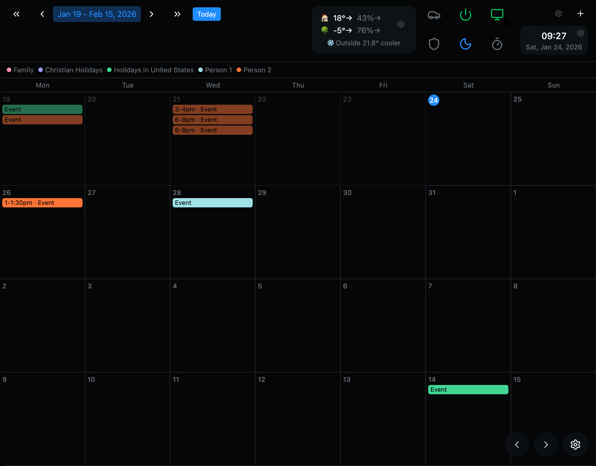

## Highlights

**Fully local voice control** - Wake word detection (Vosk) and text-to-speech (Piper) run entirely on-device. No cloud, no subscriptions, no privacy concerns. Say "Hey dashboard, set a timer for 10 minutes" and it just works.

**Real-time sync everywhere** - Edit the layout from your phone and watch it update instantly on the wall display. Server-Sent Events keep all connected clients in sync without polling.

**Smart commute alerts** - Drive Time widget only appears when you actually need it. Configure schedules (weekdays 6-8am) and minimum thresholds (show only if > 25 min). Lock to your preferred route or let it pick the fastest.

**Pixel-perfect layouts** - Position widgets by percentage for fluid layouts, or anchor them with pixel offsets for consistent sizing across different screen resolutions. Small floating widgets stay the same size whether you're on a 1080p TV or a 4K monitor.

## Features

- Drag-and-drop widget positioning with resize handles
- Multiple screens with swipe/tap navigation
- Kiosk mode with auto-hiding cursor
- Dark/light/system themes
- Zigbee sensor integration via Zigbee2MQTT
- Smart plug control (TP-Link Kasa)
- Wake-on-LAN for network devices

## Widgets

| Widget         | Description                                                                                |
| -------------- | ------------------------------------------------------------------------------------------ |
| **Weather**    | Current conditions, temperature, humidity, and multi-day forecast                          |
| **Calendar**   | Month view with Google Calendar - one account, share others to see them                    |
| **Clock**      | Time and date display with configurable format                                             |
| **Drive Time** | Commute estimates with traffic via Google Maps API                                         |
| **Sun/Moon**   | Sunrise, sunset, and moon phase                                                            |
| **AQI**        | Air quality index with health recommendations                                              |
| **UV**         | UV index with safe exposure threshold - shows when it's too harsh to be outside            |
| **Climate**    | Indoor/outdoor temperature and humidity from Zigbee sensors                                |
| **Kasa**       | Smart plug control (on/off, brightness, schedules)                                         |
| **WoL**        | Wake-on-LAN with auto MAC detection - scans network, stores defaults, per-device overrides |
| **Brightness** | Display brightness with auto-dim at sunset/sunrise based on your location                  |
| **Timer**      | Countdown timer and stopwatch with alarm                                                   |
| **PTT**        | Push-to-talk voice commands                                                                |
| **MQTT**       | Publish messages to MQTT topics (control Zigbee devices, etc.)                             |
| **AdGuard**    | DNS filtering stats from AdGuard Home                                                      |
| **Iframe**     | Embed any URL (used for notes app, other internal tools)                                   |

### Widget Screenshots

| Weather                                              | Climate                                              | Clock                                            |
| ---------------------------------------------------- | ---------------------------------------------------- | ------------------------------------------------ |
| 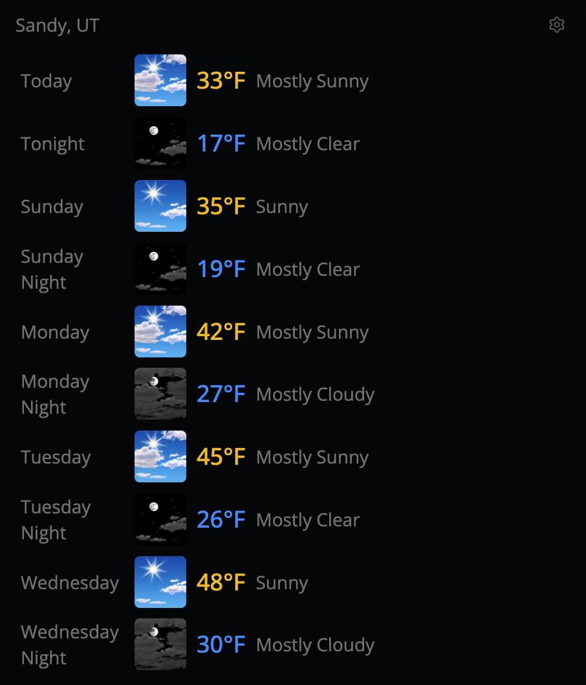 | 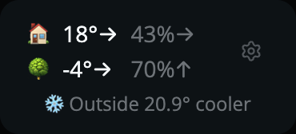 | 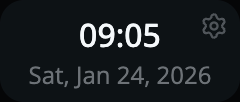 |

| Sun/Moon                                               | AQI                                          | UV                                         |
| ------------------------------------------------------ | -------------------------------------------- | ------------------------------------------ |
| 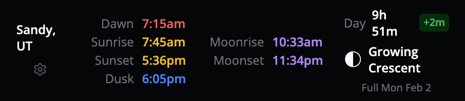 | 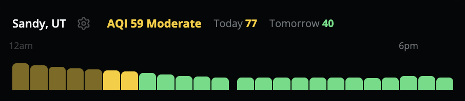 | 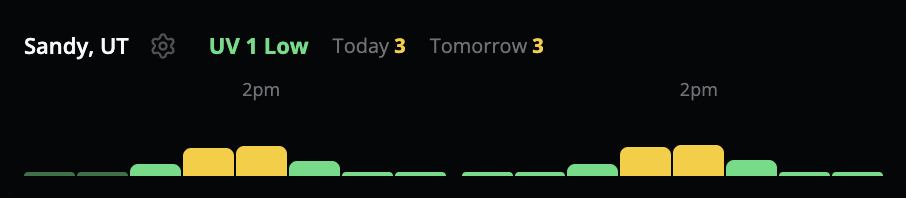 |

### Drive Time

| Traffic Overview                                           | Route Details                                                        | Route Configuration                                            |
| ---------------------------------------------------------- | -------------------------------------------------------------------- | -------------------------------------------------------------- |
| 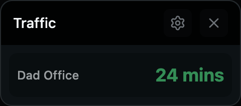 | 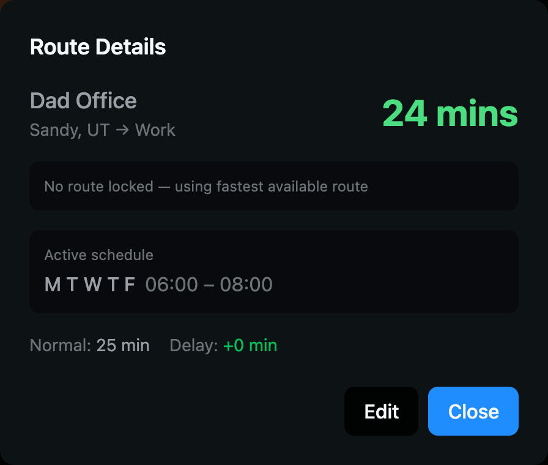 | 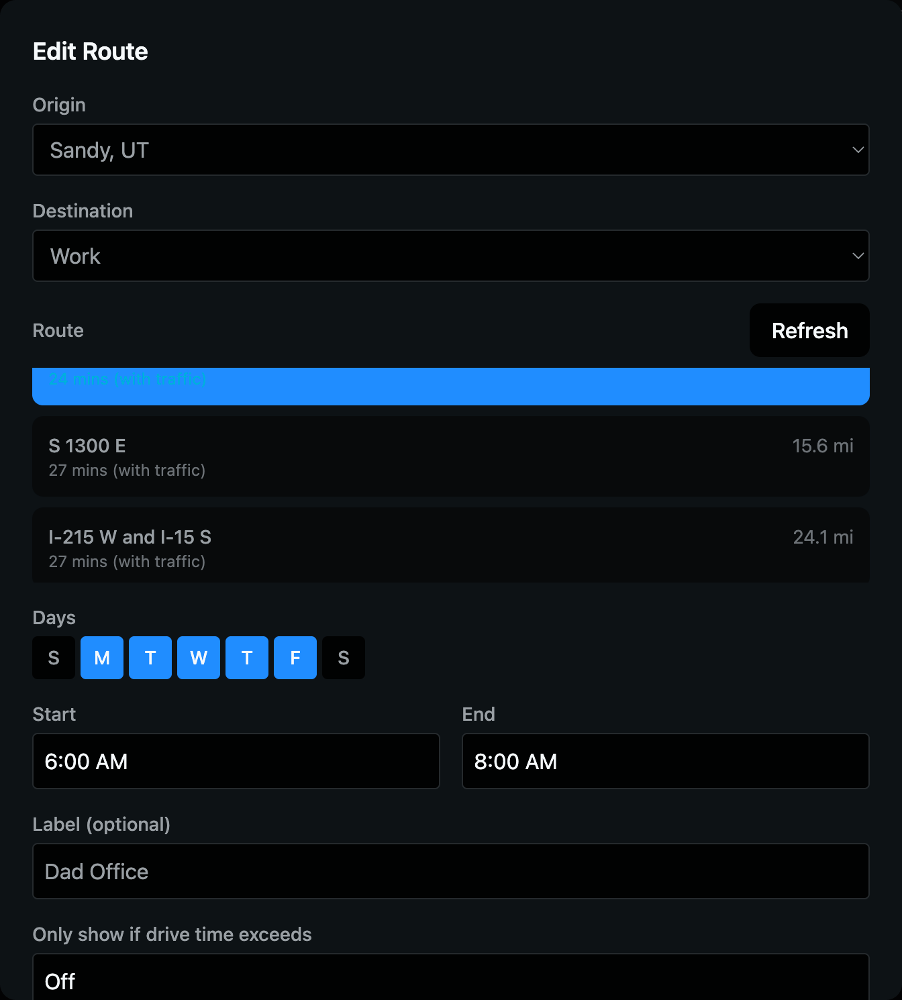 |

### Modal Screenshots

| Smart Devices                                 | Wake on LAN                                 | Timer                                           |
| --------------------------------------------- | ------------------------------------------- | ----------------------------------------------- |
|  | 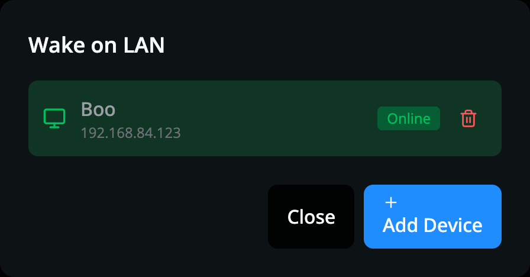 | 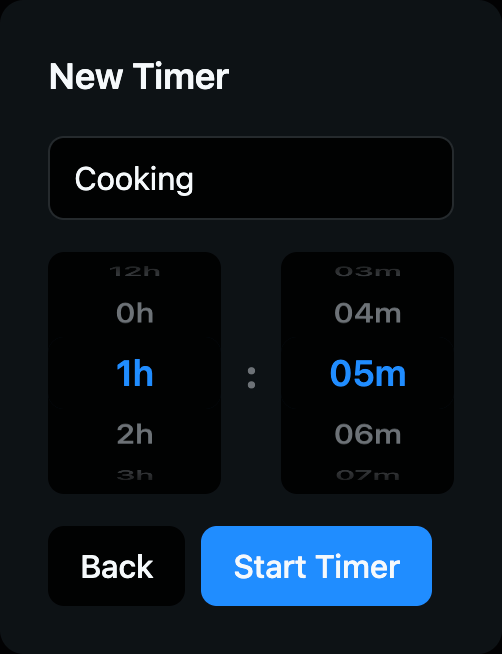 |

| Brightness                                                | Zigbee/MQTT Devices                           | Jump to Date                                                    |
| --------------------------------------------------------- | --------------------------------------------- | --------------------------------------------------------------- |
| 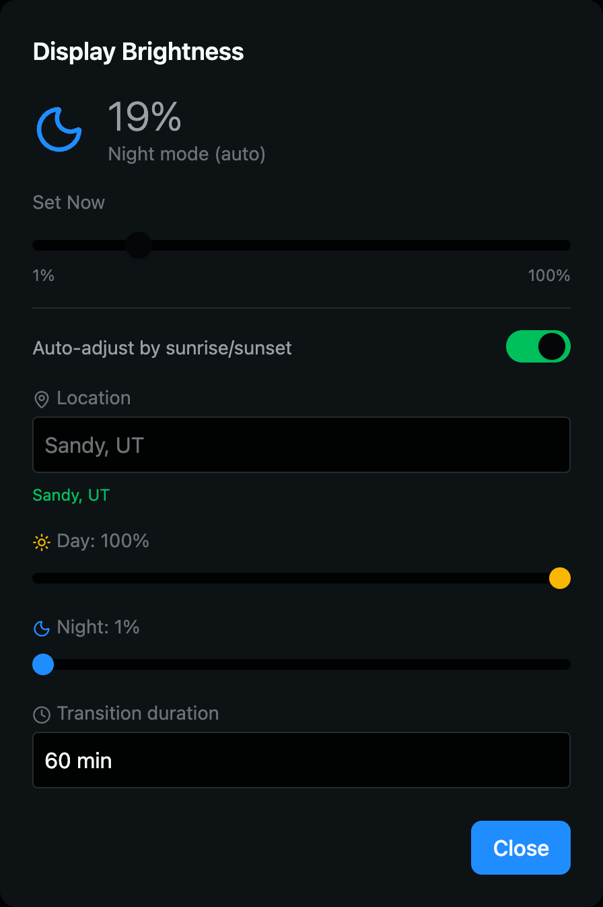 | 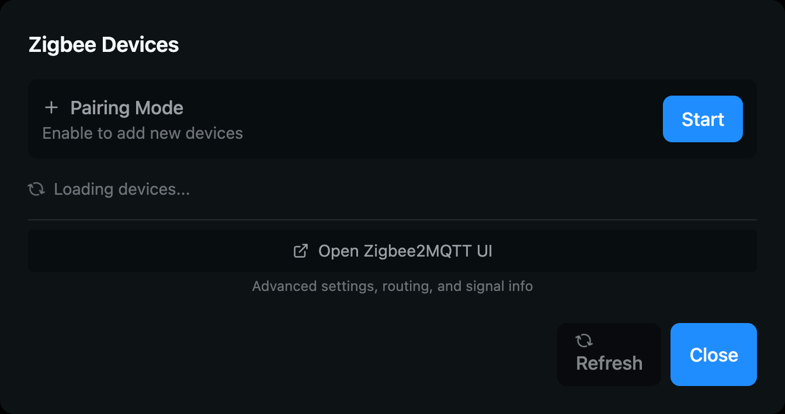 | 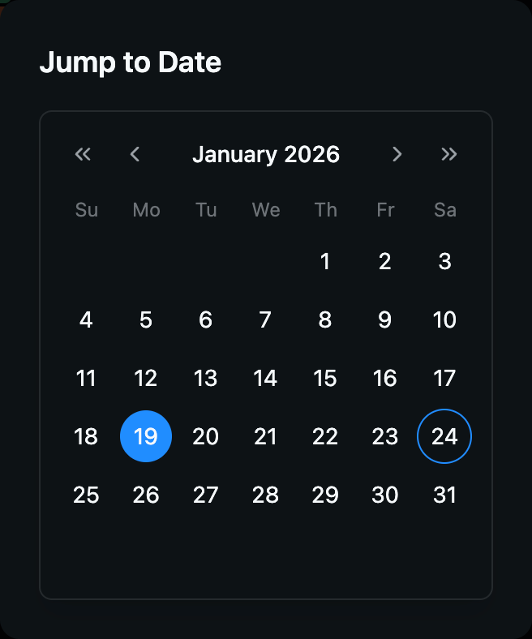 |

### Edit Mode

Tap the gear icon to enter edit mode. Add widgets, drag to reposition, resize with corner handles. Create multiple screen layouts and configure global settings (location, voice, calendars). Changes sync instantly to all connected devices.

| Global Settings                                           | Add Widget                                                    |
| --------------------------------------------------------- | ------------------------------------------------------------- |
|  | 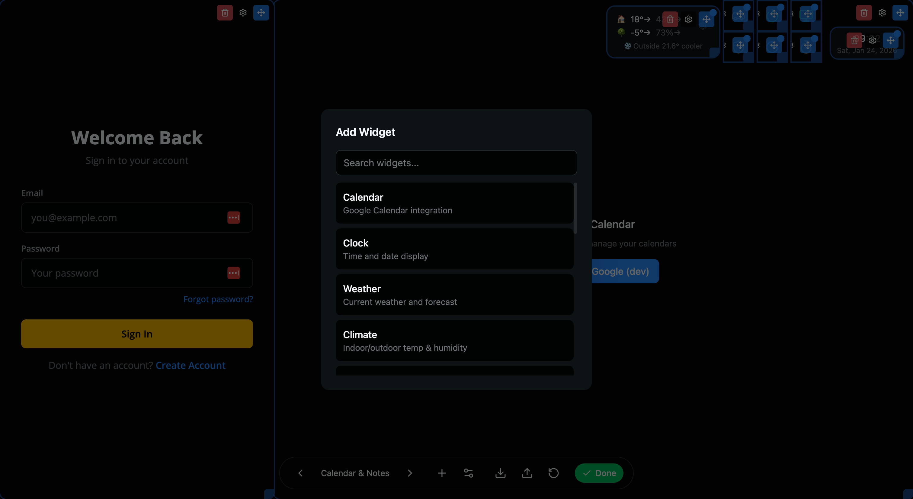 |

## Notifications

Dashboard displays reminder notifications from iframed apps (health-tracker, maintenance-tracker, etc.). When something is due or overdue, a toast modal appears with snooze options.

| Notification Toast                                     | Minimized Bell                                       |
| ------------------------------------------------------ | ---------------------------------------------------- |
|  |  |

**Features:**

- Notifications persist across page refreshes (stored in SQLite)
- Background scheduler checks every minute for due items
- Snooze for 1 hour, 4 hours, 1 day, or 3 days
- Status indicators: Overdue (red), Due Today (yellow), Due Tomorrow (blue)
- Minimizes to pulsing bell icon - tap to reopen

**For app developers:** See CLAUDE.md "Notification System" section for how to register notifications from your iframed app using `window.parent.notify()`.

## Backend

Connects to `home-relay` (Python/FastAPI) which handles Kasa device control, Zigbee2MQTT sensors, voice processing, config sync, Wake-on-LAN, display brightness, MQTT publishing, and notification management. All processing stays local on your network.

## Development

```bash
pnpm dev      # Start dev server on port 8080
```

Requires `home-relay` running on port 5111 for full functionality.
