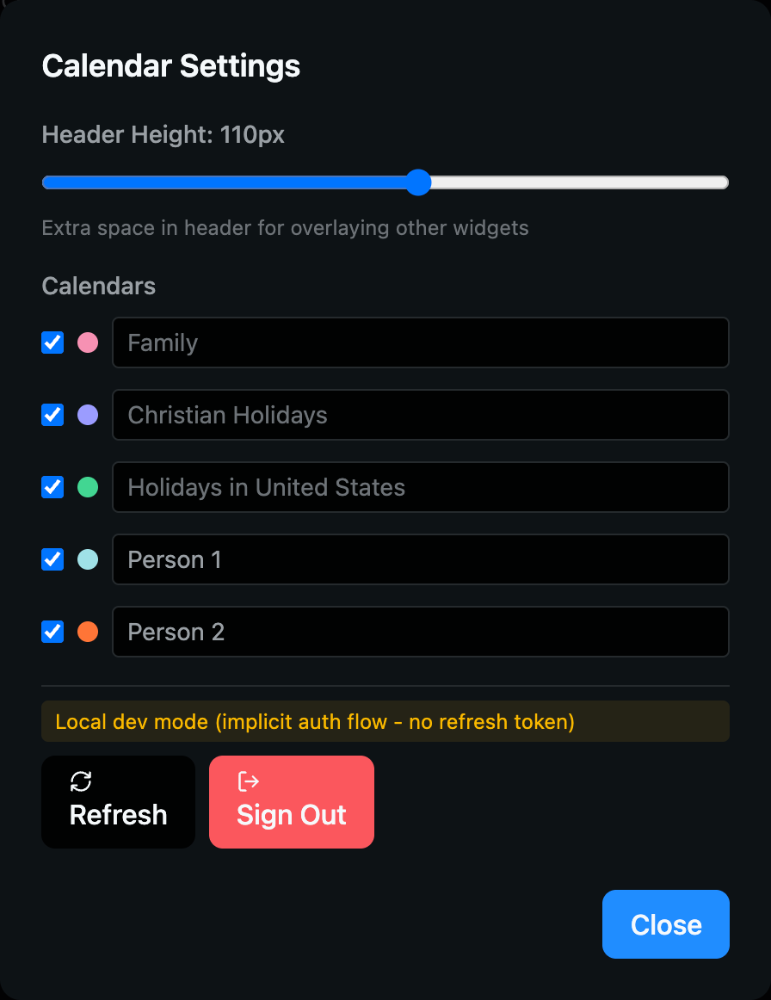
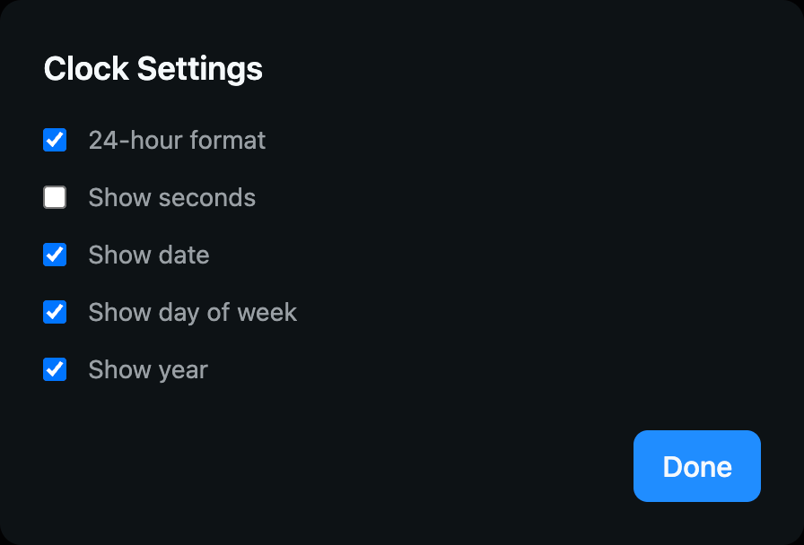

# Dashboard

Kiosk dashboard for Raspberry Pi with customizable widget layouts and smart home controls. Designed for always-on displays like wall-mounted tablets.


## Features

- Drag-and-drop widget layouts with percentage or pixel-based positioning
- Multiple screens with easy switching
- Voice commands with wake word detection (Vosk) and text-to-speech (Piper)
- Real-time config sync across devices
- Kiosk mode with cursor hiding
- Dark/light/system themes

## Widgets

| Widget         | Description                                                       |
| -------------- | ----------------------------------------------------------------- |
| **Weather**    | Current conditions, temperature, humidity, and multi-day forecast |
| **Calendar**   | Month view with Google Calendar integration                       |
| **Clock**      | Time and date display with configurable format                    |
| **Drive Time** | Commute estimates with traffic via Google Maps API                |
| **Sun/Moon**   | Sunrise, sunset, and moon phase                                   |
| **AQI**        | Air quality index with health recommendations                     |
| **UV**         | UV index with exposure warnings                                   |
| **Climate**    | Indoor/outdoor temperature and humidity from Zigbee sensors       |
| **Kasa**       | Smart plug control (on/off, brightness, schedules)                |
| **WoL**        | Wake-on-LAN to power on network devices                           |
| **Brightness** | Display brightness control with day/night automation              |
| **Timer**      | Countdown timer with alarm                                        |
| **PTT**        | Push-to-talk voice commands                                       |
| **MQTT**       | Publish messages to MQTT topics                                   |
| **AdGuard**    | DNS filtering stats from AdGuard Home                             |
| **Iframe**     | Embed any URL                                                     |

### Widget Screenshots

| | | |
|---|---|---|
|  |  |  |
| Weather | Climate | Clock |
|  |  |  |
| Sun/Moon | AQI | UV |

### Modal Screenshots

| | | |
|---|---|---|
|  |  |  |
| Smart Devices | Wake on LAN | Timer |
|  |  |  |
| Brightness | Calendar Settings | Clock Settings |

### Edit Mode

| | |
|---|---|
|  |  |
| Global Settings | Add Widget |

## Backend Services

### Home Relay (Python/FastAPI)

The dashboard connects to a local `home-relay` service that provides:

- **Kasa API** - Device discovery, power control, brightness, schedules, energy monitoring
- **Sensor API** - Climate data from Zigbee2MQTT sensors
- **Voice API** - Vosk speech recognition and Piper TTS
- **Config API** - Dashboard configuration with SSE real-time sync
- **Wake-on-LAN** - Send magic packets to wake devices
- **Brightness** - Control display brightness via system commands
- **MQTT** - Publish/subscribe for home automation
- **AdGuard** - Query stats from AdGuard Home

### Zigbee2MQTT

Climate sensors (temperature, humidity) are read from Zigbee2MQTT via the relay service. Configure sensor friendly names in dashboard settings to display indoor/outdoor readings.

## Configuration

Dashboard layout is stored in `public/config/dashboard.json` and synced via the relay. Edit mode allows remote layout changes from any device.

## Development

```bash
pnpm dev      # Start dev server on port 8080
```

Requires `home-relay` running on port 5111 for full functionality.
